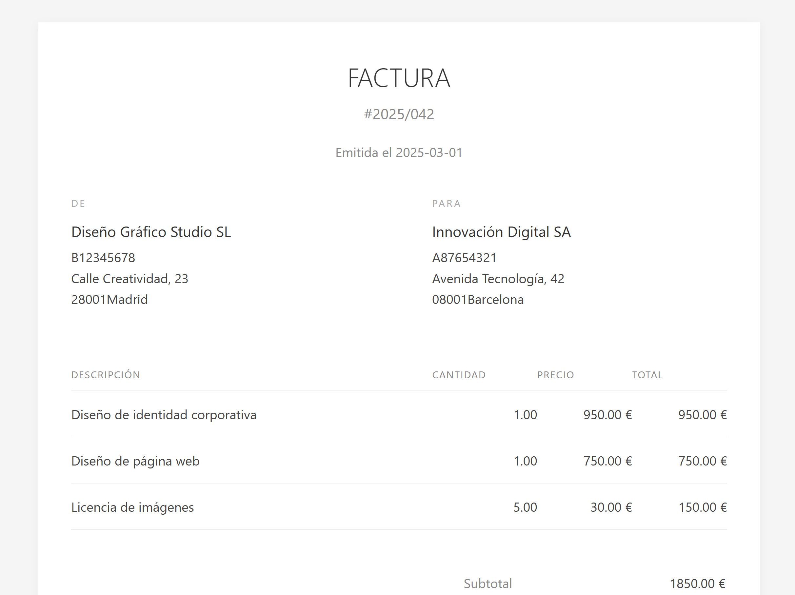

# Transformación de FacturaE a XHTML

Este repositorio contiene plantillas XSLT para transformar archivos XML de FacturaE (el formato estándar español de factura electrónica) a documentos XHTML que permiten visualizar de forma amigable los datos más significativos de las facturas para los clientes.

## Contenido del repositorio

- [`/xslt&xml`](/xslt&xml): Contiene las plantillas XSLT desarrolladas.
  - [`facturae-empresarial.xslt`](/xslt&xml/facturae-empresarial.xslt): Plantilla con estilo empresarial formal.
  - [`facturae-minimalista.xslt`](/xslt&xml/facturae-minimalista.xslt): Plantilla con estilo minimalista y moderno.
  - [`facturaeEmpresarial.xml`](/xslt&xml/facturaEmpresarial.xml): Factura con estilo empresarial formal.
  - [`facturaeMinimalista.xslt`](/xslt&xml/facturaeMinimalista.xml): Factura con estilo minimalista y moderno.
- [`/css`](/css): Contiene los documentos css para aplicar estilos en las transformaciones.

## Descripción de las plantillas XSLT

### 1. Plantilla Empresarial

Esta plantilla está diseñada con un estilo profesional y formal, ideal para empresas que desean transmitir una imagen corporativa sólida.

#### Características principales:

- Encabezado con logo y datos de factura claramente diferenciados
- Secciones de emisor y receptor bien definidas
- Tabla de líneas de factura con formato empresarial
- Sección de totales con formato claro para distinguir base imponible, impuestos y total
- Información de pago en sección separada
- Pie de página con información legal

#### Vista previa

[Ver el código fuente XSLT](/xslt&xml/facturae-empresarial.xslt)

[Ver ejemplo de XML generado](/xslt&xml/facturaEmpresarial.xml)

### 2. Plantilla Minimalista

Esta plantilla está diseñada con un enfoque minimalista y moderno, con amplio espacio en blanco y tipografía ligera.

#### Características principales:

- Diseño centrado con amplio espaciado
- Tipografía limpia y moderna
- Encabezado minimalista con número de factura destacado
- Secciones "DE" y "PARA" claramente diferenciadas
- Tabla de líneas simplificada
- Sección de totales a la derecha con formato claro
- Información de pago con estilo consistente
- Pie de página minimalista

#### Vista previa

[Ver el código fuente XSLT](/xslt&xml/facturaeMinimalista.xslt)

[Ver ejemplo de xml generado](/xslt&xml/facturaMinimalista.xml)

## Cómo utilizar las plantillas

Para transformar un archivo XML de FacturaE abre el xml en un navegador moderno

Las plantillas incluyen:
- CSS integrado para facilitar la distribución
- Estructura responsive para mejor visualización en diferentes dispositivos

## Recursos utilizados

- [MCLibre - XML y XSLT](https://www.mclibre.org/consultar/xml/lecciones/xml-xslt.html)
- [Eniun - Tutorial XSLT](https://www.eniun.com/tutorial-xslt/)
- [MDN Web Docs - XSLT](https://developer.mozilla.org/en-US/docs/Web/XML/XSLT/Guides)
- [TutorialsPoint - XSLT](https://www.tutorialspoint.com/xslt/index.htm)
- [W3Schools - XSLT Element Reference](https://www.w3schools.com/xml/xsl_elementref.asp)

## Licencia

Este proyecto está licenciado bajo [MIT License](LICENSE).
